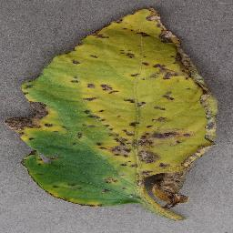
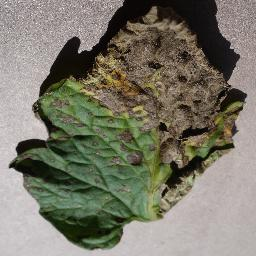
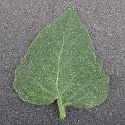
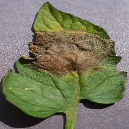
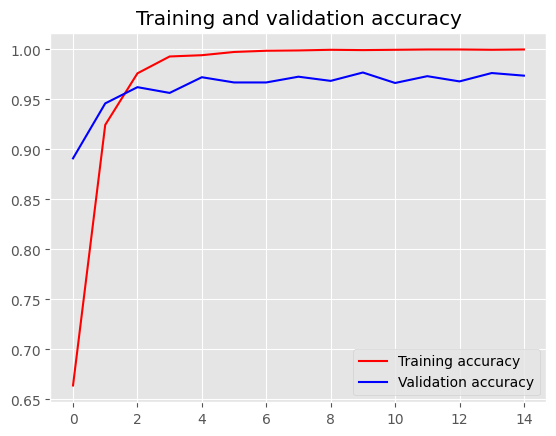

<!-- First Row -->
<p align="center">
  
  
  
  
</p>

This project aims to detect and classify tomato diseases using transfer learning with the InceptionV3 model. Transfer learning allows us to leverage the pre-trained InceptionV3 model's knowledge on a large dataset and fine-tune it for our specific task of tomato diseases detection. The trained model is deployed on a website using TensorFlow JavaScript, allowing users to upload images and receive predictions regarding the presence of diseases in tomatoes.

[live Demo](https://leafscan.netlify.app//)

## Usage
To detect and classify tomato diseases using the web application, follow these steps:

1. **Access the Web Application:** click here [live Demo](https://leafscan.netlify.app//) to access the website where the tomato diseases detection application is hosted.

2. **Upload an Image:** On the website's homepage, Click on the "Upload Image" button to select an image of a tomato plant that you want to analyze.

3. **Image Guidelines:** For accurate predictions, make sure the uploaded image is clear and shows a single tomato leaf with visible symptoms (if any). The supported image formats are JPEG, PNG.

4. **Submit the Image:** After selecting the image, click on the "Detect" button to start the analysis.

5. **Prediction Results:** Wait a few moments as the trained model processes the image. Once the analysis is complete, you will see the results displayed on the website.

6. **Disease Detection:** The results will indicate whether the tomato leaf in the image is healthy or affected by a specific disease. If a disease is detected, the web application will also display the name or type of the disease (e.g., "Early Blight," "Late Blight," "Bacterial Spot" etc.).

7. **Interpretation:** Based on the predictions, you can take appropriate actions to address the detected disease, such as applying relevant treatments or consulting with agricultural experts.

Try Different Images: You can repeat the process and analyze different images to see how our model performs on various tomato plant samples.

## Model Training
During the training process, the model goes through multiple epochs, where each epoch represents one complete iteration over the entire dataset. The training accuracy and validation accuracy both approach high values, indicating that the model has learned to perform well on the training data and generalize well to unseen validation data.

<p align="center">


</p>
Overall, the training process shows a steady improvement in the model's performance. The model successfully learns to classify tomato diseases with high accuracy, reaching nearly 100% accuracy on the training data and over 97% accuracy on the validation data by the end of training.
### Epoch 3/15
* **Training Loss:** 0.00
* **Training Accuracy:** 1.00
* **Validation Loss:** 0.09
* **Validation Accuracy:** 0.97

## Note
The model's accuracy is influenced by the quality and composition of the images you upload. For the best results, provide clear images of tomato plants, preferably with high resolution and well-defined symptoms (if present).

Enjoy using the tomato diseases detection web application and feel free to provide feedback or report any issues you encounter. I am continuously working to improve the model's performance and enhance the user experience.

## Requirements
To run this project, you will need the following:

* Python (>= 3.6)
* Jupyter Notebook or JupyterLab (for running the notebooks)
* TensorFlow (>= 2.0)
* Keras (>= 2.0)
* TensorFlow JavaScript (for website deployment)

## Setup
To run leafscan locally, follow these steps:
1. Clone this repository to your local machine using the following command:
   ```
   https://github.com/Hassan-Shoayb/leafscan.git
   ```

2. Navigate to the project directory:
   ```
   cd leafscan
   ```
3. Start the local development server and Open your web browser and visit the port to leafscan.

## Technologies Used
Leafscan is built using the following technologies:

1. TensorFlow
2. keras
3. TensorFlow js
4. Numpy
5. JavaScript
6. scikit learn
7. Pandas
8. HTML
9. CSS
10. Netlify (for deployment)

## Contributing
Contributions to leafscan project are welcome and encouraged! If you have any ideas for improvements, new features, or bug fixes, please submit an issue or create a pull request.
